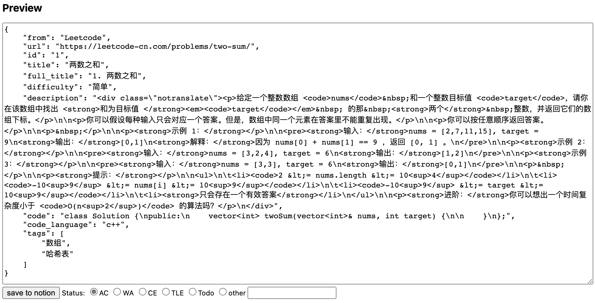

# Code Plus

CodePlus 是一个用于快速保存算法刷题记录到 Notion 笔记的 Chrome 浏览器插件，目前支持以下平台：

- [x] AcWing (https://www.acwing.com/problem/content/*/)
- [x] LeetCode CN (https://leetcode-cn.com/problems/*/)
- [ ] Codeforces
- [ ] CCF cspro
- [ ] Luogu

## 使用说明

请注意：目前 CodePlus 仅是一个原型，极其简陋也没有 option 页面，所以需要自行修改代码、自行编译才可用。后续会考虑完善。

### 创建 Notion 集成

1. 参考 [Notion 官方说明](https://developers.notion.com/docs/getting-started) 添加一个 integration，记好 secret；

2. 创建一个页面放数据库，数据库需要有如下 properties（名称必须分毫不差，括号内的是属性的类型）：

- Link (url)
- From (select)
- Title (title)
- Data (date)
- Status (select)
- Difficulty (select)
- Tags (multi-select)

之后点击 share，然后拷贝链接，链接后面一段就是数据库 id（如果你不明白请看上面文档）。

此外，share 中需要授权给你自己创建的 integration.

### 配置插件

首先克隆仓库，由于含有子仓库，你需要添加 `--recursive` 选项。

在克隆仓库后，将文件 `src/config.js.template` 复制并更名为 `src/config.js`，并修改其中的 secret 以及 database_id 为你自己的。

## Build and Install

运行：

```
npm install
npm run build
```

之后在浏览器插件管理页面打开开发者模式，选择加载已解压的插件，选择项目内的 build 目录。

For more details, see [Chrome Extension CLI](https://github.com/dutiyesh/chrome-extension-cli)'s description.

## 使用方法

点击工具栏上的插件图标即可，会弹出一个预览页面，向你展示解析好的 json：



如果有误你可以手动在文本框内修改。

在设置好 Status 后，点击 save to notion 按钮即可。

没有反应的话说明不支持当前页面。
